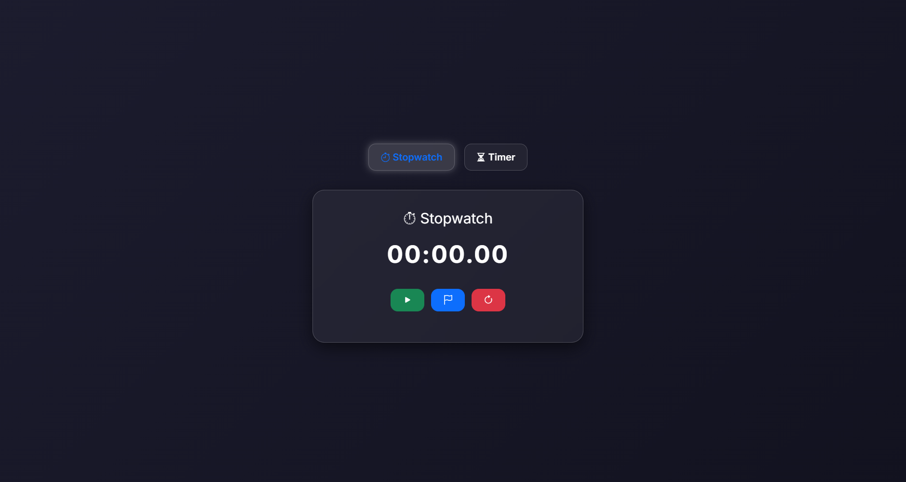

# تایمر و کرنومتر / ⏱ Stopwatch and Timer 

[](https://hosein-mahmoudi.github.io/glass-stopwatch-timer/)

---
## 🌐 دمو آنلاین / Live Demo

🔗 **مشاهده آنلاین:**  
👉 [https://hosein-mahmoudi.github.io/glass-stopwatch-timer/](https://hosein-mahmoudi.github.io/glass-stopwatch-timer/)

---

## 📖 توضیح / Description

<div dir="rtl">

این پروژه شامل دو بخش مجزا است:  
۱. **کرنومتر (Stopwatch)** برای اندازه‌گیری زمان با امکان توقف، ادامه، ثبت دور (Lap) و بازنشانی.  
۲. **تایمر (Timer)** برای شمارش معکوس با قابلیت تنظیم دقیقه و ثانیه، توقف، ادامه و ریست.  

طراحی آن با استفاده از سبک **شیشه‌ای و مدرن (Glassmorphism)** انجام شده و با بوت‌استرپ و آیکون‌های Bootstrap Icons ترکیب شده است.

</div>

This project includes two main components:  
1. **Stopwatch** – Start, pause, lap recording, and reset functions.  
2. **Timer** – Countdown with customizable time, pause/resume, and reset options.  

The interface follows a **modern glassmorphism design**, styled with Bootstrap and Bootstrap Icons.

---

## ✨ ویژگی‌ها / Features

<div dir="rtl">

<ul>
  <li>طراحی مدرن و شیشه‌ای (Glassmorphism)</li>
  <li>واکنش‌گرا برای موبایل، تبلت و دسکتاپ</li>
  <li>ثبت Lap در کرنومتر</li>
  <li>هشدار پایان زمان در تایمر</li>
  <li>کد تمیز و ماژولار با استفاده از JavaScript مدرن</li>
</ul>

</div>

- Modern and glass-style (Glassmorphism) UI  
- Fully responsive for all devices  
- Lap recording in Stopwatch mode  
- End-of-time alert in Timer mode  
- Clean and modular JavaScript code  

---

## ⚙️ تکنولوژی‌ها / Technologies Used

- **HTML5**
- **CSS3 (Glassmorphism design)**
- **JavaScript (ES6+)**
- **Bootstrap 5**
- **Bootstrap Icons**


---

## ⚙️ نحوه استفاده / How to Use
  
1. پروژه را دانلود یا کلون کنید.  
```bash
git clone https://github.com/hosein-mahmoudi/glass-stopwatch-timer.git
cd glass-stopwatch-timer

